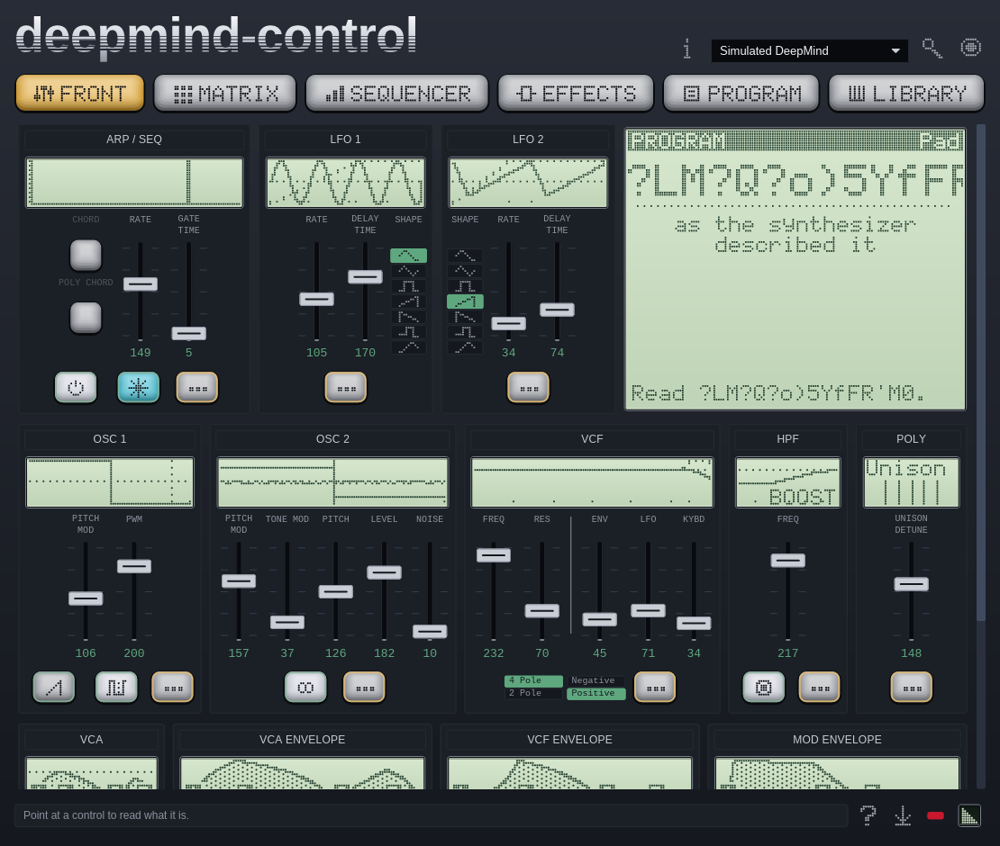
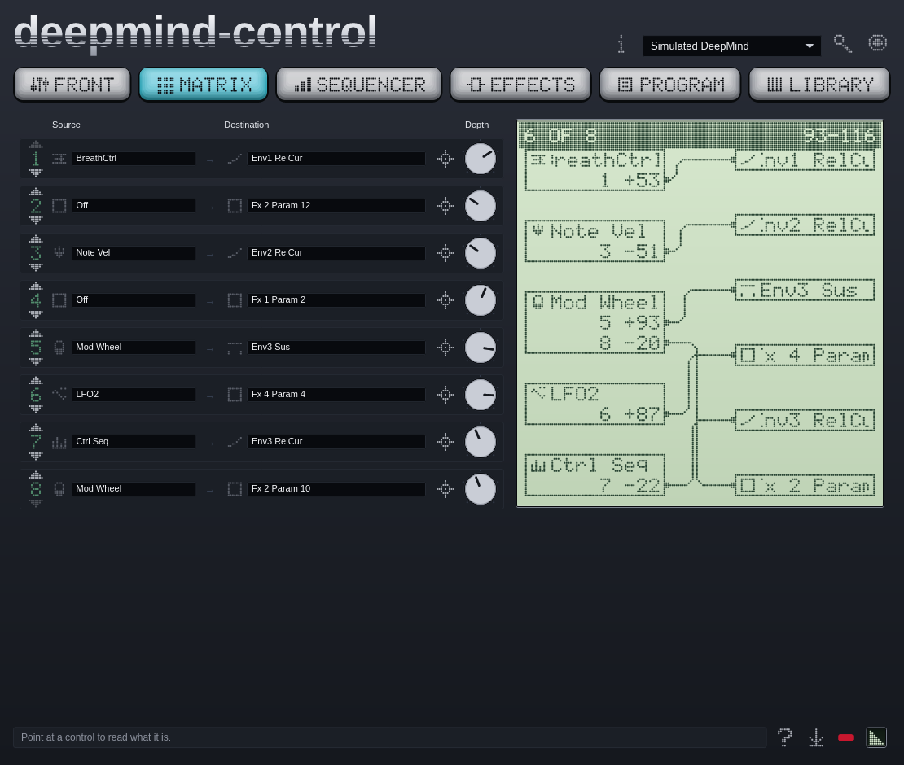
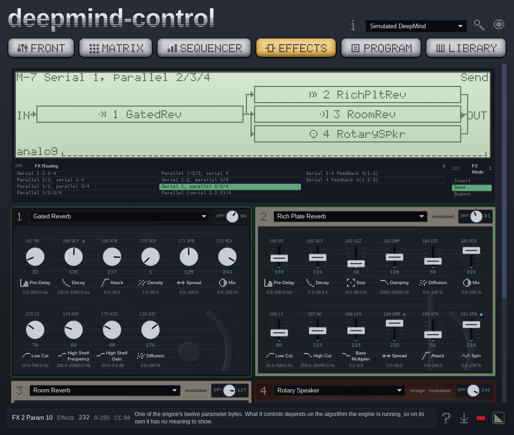

<p align="center">
  
</p>

<p align="center">
  
  <a href="https://github.com/MysteriousWolf/deepmind-control/actions/workflows/ci.yml"></a>
  <a href="https://github.com/MysteriousWolf/deepmind-midi"></a>
  <a href="https://github.com/MysteriousWolf/deepmind-control/blob/main/LICENSE"></a>
</p>

An editor and librarian for the Behringer DeepMind, on the desktop and in a DAW.

Built on [`deepmind-midi`](https://github.com/MysteriousWolf/deepmind-midi),
which owns the protocol and never opens a port. This repository owns the port
and the interface.

```
DeepMind <--MIDI--> port <--bytes--> deepmind-midi <--events--> the interface
                     ^
              midir, or the DAW
```

**Status: the editor and the librarian work. What is left is polish, and then
the plugin.** See [the plan](docs/plan.md) for the order.

## The two surfaces, and what opens over them

The window has two surfaces and a switch between them, and a sheet that opens
over either. The patch survives all of it.

### Front panel

The surface the window opens on: the instrument's own face, with the controls
the hardware puts a fader under and the `EDIT` press each plate carries. Every
plate also carries a dot-matrix display of its own section, which is the one
place this window is not the instrument. The shapes on those displays are
functions the library publishes; each screen is a sample loop over one.



### Editor

Fourteen panels, one `EDIT` press behind the front panel, covering all 242
parameters. A press opens its section as a sheet across the window with the
panel still underneath it, which is what the press does on the instrument: its
display becomes that section and its front does not move. Escape, the mark on
the sheet, or a press on the window around it puts the sheet away.

Every panel is generated from the library's parameter table rather than laid out
by hand, and values the synthesizer reported are drawn differently from values
this window set. The modulation matrix reads its eight routings across as rows,
with a patch bay beside them drawn from the routings themselves.

Four of the fourteen have no plate on the front panel to carry an `EDIT`, so
nothing opens them: see [to do](docs/todo.md).



### Effects

All four engines at once, each in the case the manual prints beside its
algorithm, with its twelve bytes in the columns and rows the instrument's own FX
page uses. Above them is the chain the four are wired into, drawn from the
library's edge lists rather than from the topology's name.



The librarian is the second surface: it reads and writes `.syx` files, reads a
bank off the instrument with a progress bar and a stop button, browses what it
found in slot order, and loads any of it into the edit buffer as a difference
rather than as 242 parameters.

Everything above runs against the library's simulated synthesizer, which appears
in the port list as an ordinary choice, so none of it needs hardware.

The window is dark, in the instrument's own colours. The palette is read off the
mark in `docs/logo.svg`, and one file holds it for both builds.

## What it is

**A desktop application.** It owns its MIDI port, finds the synthesizer, edits
it live, and reads and writes `.syx` files.

**A plugin**, after the desktop application, so that patches travel with a
project. AU and VST3, wrapped around a CLAP that ships too and arrives first.
Two modes:

- *Simple*, which selects programs and nothing else.
- *Advanced*, which is the desktop editing surface in a plugin window.

Editing is the same in both builds. Bank and librarian operations are desktop
only: a preset pack is 35 kB of SysEx, and a plugin event buffer is the wrong
place for it.

## Hardware

DeepMind 6, 6X, 12, 12X, 12D and 12XD. Firmware 1.0 and 1.1, comms protocol
versions 6 and 7, all handled by the library.

Nothing here has been run against a synthesizer yet.

## Documentation

|  |  |
| --- | --- |
| [Plan](docs/plan.md) | What is being built, in what order, and the decisions behind it |
| [Interface](docs/interface.md) | What a control looks like, and its three states |
| [Waiting](docs/waiting.md) | What has been asked of the library, and what each answer changes here |
| [To do](docs/todo.md) | What a change here left open, and who has to decide it |
| [Protocol](https://github.com/MysteriousWolf/deepmind-midi/blob/main/docs/midi-spec.md) | Lives in the library, with the specification it is generated from |
| [NOTICE](NOTICE) | Trademarks, and where the marks come from |

## Layout

```
crates/
  deepmind-host/    port ownership and the device loop. No interface.   written
  control-ui/       every view and widget. No runtime, no window.       generated
  control/          the desktop application, and the librarian.         editor and files
  control-plugin/   the plugin.                                         stage 6
```

`deepmind-host` is the only crate here that would be useful to somebody else, so
it is the only one carrying the prefix. The interface crate depends on
`iced_core` and `iced_widget` rather than on `iced`, so one view layer compiles
under both the desktop runtime and baseview.

## Development

```
cargo run -p control
cargo run -p control -- pack.syx       # opens with that pack on the shelf
cargo test --workspace
cargo clippy --workspace --all-targets
cargo fmt --all --check
```

`cargo test --workspace` needs no hardware. The library ships a simulated
synthesizer, and `deepmind-host` puts it in the port list alongside the real
ports.

### Previews

`docs/previews/` holds a picture of every surface: the front panel, each of the
fourteen sections as the sheet an `EDIT` opens over it, and the shelf. The
application takes them itself.

```
tools/previews.fish                 # a new set, from a seed off the clock
tools/previews.fish --seed 1234     # that set again, exactly
tools/previews.fish --check         # the release gate
```

The window is pointed at the simulated synthesizer, and the unit powers up
holding a program built from the seed, so every parameter lands somewhere inside
its own range. The pictures show an instrument holding a sound rather than a
window that has just opened, and a new run turns up arrangements a fixed sound
would hide. The seed is printed and recorded beside the pictures, so a set
somebody liked can be had back.

It needs a display. Whatever is already there is used, and on a machine with
none the script starts an `Xvfb` and draws in software.

**Run `--check` before cutting a release.** Screenshots go stale silently,
because nothing reads a picture. The check fails when one is missing, when
`crates/` has uncommitted changes, and when the set was taken before the last
commit that touched `crates/`. It does not compare the images: the sound in them
is random by design, and what the gate holds is that somebody generated them
from the code as it stands.

### Desktop binaries

Anything the workspace builds locally, CI builds on all three desktops. The
**Build** workflow in the Actions tab is the one that hands something back: run
it by hand, tick the platforms you want and whether you want SHA-256 checksums,
and each ticked platform turns up as an archive on the run — the editor, the
licence, the notices and this readme.

```
Actions -> Build -> Run workflow -> [x] Linux  [x] macOS  [x] Windows  [x] checksums
```

macOS builds for Apple silicon, Linux and Windows for x86_64. The workflow is
also `workflow_call`, so the release that comes later calls it rather than
copying it: the binaries a release publishes are built the same way as the ones
somebody tested.

### Building the plugin

The plugin comes after the desktop application and is built and bundled
separately. The CLAP is what the other two formats are made from:

```
cargo nih-plug bundle control-plugin --release
```

The AU and the VST3 are wrapped around that CLAP with
[clap-wrapper](https://github.com/free-audio/clap-wrapper), which needs CMake
and a C++ toolchain. AU is macOS only.

### Platform dependencies

Linux needs ALSA's development headers for midir (`libasound2-dev`, or
`alsa-lib` on Arch), and the usual X11 and GL development headers for baseview.
Running the window also wants `libxkbcommon-x11`, which a desktop already has
and a bare container does not.

macOS and Windows need nothing beyond the toolchain and CMake: midir talks to
CoreMIDI and WinMM.

The iced version is pinned, and it is pinned to whatever the baseview adapter
supports rather than to the newest release. The two builds share a view layer
only for as long as they share an iced.

## License

Apache-2.0. See [LICENSE](LICENSE).

Not affiliated with or endorsed by Behringer or Music Tribe.
